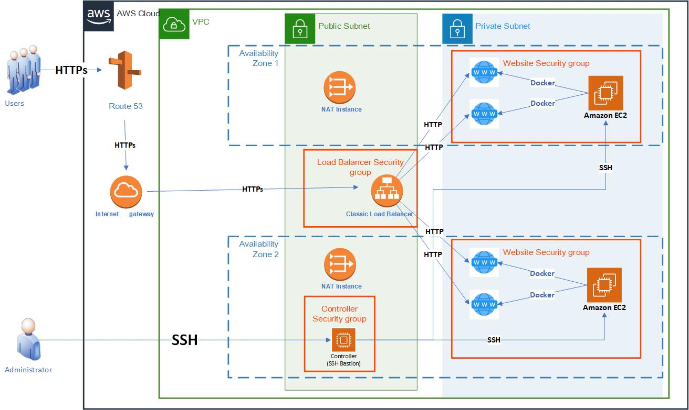

# Creating a simple load balanced website in AWS using an ALB and auto-scaling group

## Using Terraform to deploy the infrastructure
The code found here is a part of my blog on using "Infrastructure as Code" with Terraform.  I'm writing different exercises on how to use Terraform to create AWS deployments in my WordPress site.  See [Deploying an Auto Scaling Group and Application Load Balancer in AWS](https://josephomara.com/2022/06/23/use-terraform-to-deploy-an-application-load-balancer-in-aws-with-an-auto-scaling-group/(opens in a new tab))

## Features
* Using Terraform to deploy infrastructure [Why use Infrastructure as Code](https://josephomara.com/2021/08/23/why-infrastructure-as-code/(opens in a new tab))
* use Terraform to deploy an Auto Scaling Group and an Application Load Balancer in AWS
* Load balancing a simple website that displays the EC2 host you are connected to in AWS

## Requirements

- Must have an AWS account
- Install AWS CLI, Configure AWS CLI, Install Terraform
- AWS Administrator account or an account with the following permissions:
  - reate an IAM profile
  - create VPC, subnets, and security groups
  - create a internet gateway, NAT instances and routing tables
  - Privilege to create EC2 instances and manage EC2 resources
  - Create and configure an Application Load Balancer
  - Create and configure an Auto Scaling Group
- Ec2 Key Pair for the region

## Installation
 Clone this repository into any folder of your choice

* Be sure to edit the variables in terraform.tfvars (currently it has bogus values)
* If you are placing this into any other region than us-west-1, you will have to change the AMI ID for our NAT instances in the file "vpc.tf". 
* In your terminal, goto the VPC folder and execute the following commands:

   1. `Terraform init`
   2. `terraform validate`
   3. `Terraform apply`

